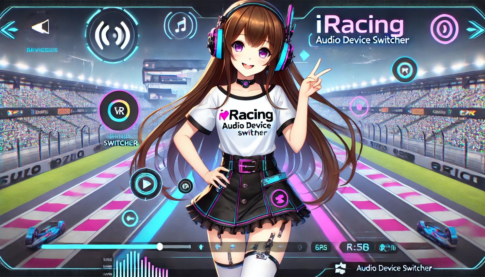

# Conmutador de Dispositivo de Audio para iRacing 🎧

<div align="center">
  
</div>

🌍 Traducciones del README
[中文说明](README.cn.md) | [日本語の説明](README.ja.md) | [한국어 설명](README.ko.md) | [Français](README.fr.md) | [Português](README.ptbr.md) | [Türkçe](README.tr.md) | [Русский](README.ru.md) | [Español](README.es.md) | [Italiano](README.it.md) | [Deutsch](README.de.md)

✨ Características
- 🛠️ Detección automática de iRacing
- 🔄 Cambio automático entre dispositivo de audio predeterminado y VR
- 🎤 Cambio automático entre micrófono predeterminado y VR
- 💾 Configuración persistente
- 📜 Registro detallado con rotación automática de logs
- 🔄 Cambio de dispositivo de audio tolerante a fallos con mecanismo de reintentos
- 👥 Configuración amigable para el usuario en el primer uso
- 🛑 Apagado limpio con CTRL+C

🚀 Inicio Rápido

### Requisitos Previos
- Windows PowerShell 5.1 o superior, se recomienda PowerShell 7+
- Derechos de administrador para la instalación inicial del módulo AudioDeviceCmdlets
- Dispositivos de audio compatibles con Windows 10/11
- Software de simulación iRacing

### Instalación
1. Descargue toda la carpeta del proyecto.
2. Asegúrese de que la ejecución de scripts de PowerShell esté permitida:
   ```powershell
   Set-ExecutionPolicy -ExecutionPolicy RemoteSigned -Scope CurrentUser
   ```
3. El módulo necesario AudioDeviceCmdlets se instalará automáticamente en el primer inicio.

### Configuración por Primera Vez
1. Inicie el script `ir-audio-switch.ps1`.
2. En la primera ejecución, se le solicitará:
   - Seleccionar su dispositivo de audio predeterminado.
   - Seleccionar su dispositivo de audio VR.
   - Seleccionar su micrófono predeterminado.
   - Seleccionar su micrófono VR.
3. La selección se guarda automáticamente.

### Uso
1. Inicie el script:
   ```powershell
   .\ir-audio-switch.ps1
   ```
2. El script se ejecuta en segundo plano y monitorea iRacing:
   - Cuando iRacing se inicia, cambia automáticamente al dispositivo de audio VR y al micrófono VR.
   - Cuando iRacing se cierra, vuelve al dispositivo de audio y micrófono predeterminados.
3. Salga del script con CTRL+C.

### Configuración
La configuración se almacena en `ir-audio-switch.cfg.json` y contiene:
- Dispositivo de audio predeterminado (`defaultDevice`)
- Dispositivo de audio VR (`vrDevice`)
- Micrófono predeterminado (`defaultMic`)
- Micrófono VR (`vrMic`)
- Número máximo de líneas de registro (`maxLogLines`)

### Parámetros
El script acepta los siguientes parámetros:
- `-LogFile`: Ruta al archivo de registro (por defecto: ir-audio-switch.log en el directorio del script)
- `-MaxLogLines`: Número máximo de líneas a mantener en el archivo de registro (por defecto: 42, rango: 10-10000)

Ejemplo:

```powershell
.\ir-audio-switch.ps1 -LogFile "C:\ruta\a\logfile.log" -MaxLogLines 100
```

## Ejemplos de Configuración

Ejemplo de configuración en `ir-audio-switch.cfg.json` para una configuración típica de carreras en VR:

```json
{
  "defaultDevice": "Altavoces (Realtek High Definition Audio)",
  "vrDevice": "Auriculares (Dispositivo de Audio Virtual Oculus)",
  "defaultMic": "Micrófono (Realtek High Definition Audio)",
  "vrMic": "Micrófono (Dispositivo de Audio Virtual Oculus)",
  "maxLogLines": 100
}
```

## Solución de Problemas

Si encuentra algún problema, intente los siguientes pasos:

1. Asegúrese de que sus dispositivos de audio están correctamente conectados y reconocidos por Windows.
2. Verifique el archivo de registro en busca de mensajes de error.
3. Asegúrese de tener los permisos necesarios para ejecutar el script y cambiar los dispositivos de audio.
4. Vuelva a ejecutar la configuración inicial si ha cambiado sus dispositivos de audio.

## Licencia

Este proyecto está licenciado bajo la Licencia MIT. Consulte el archivo `LICENSE` para más detalles.